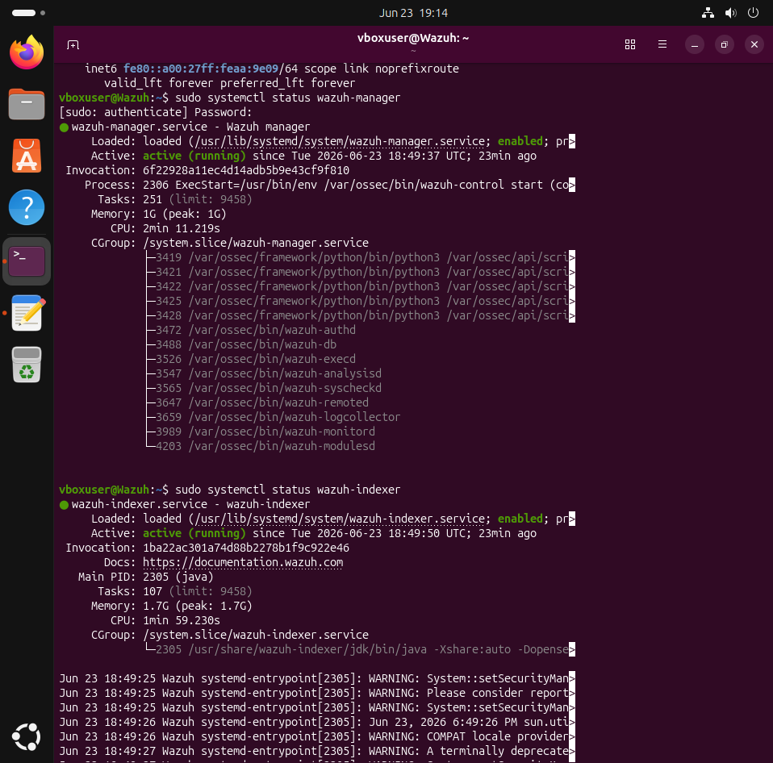
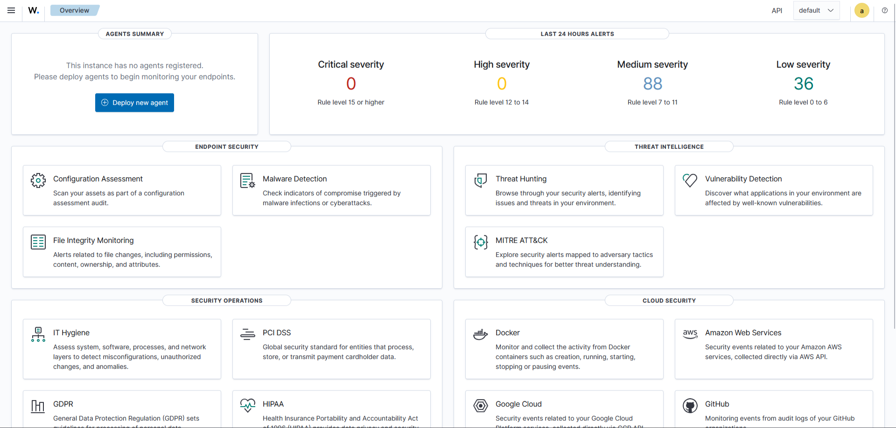
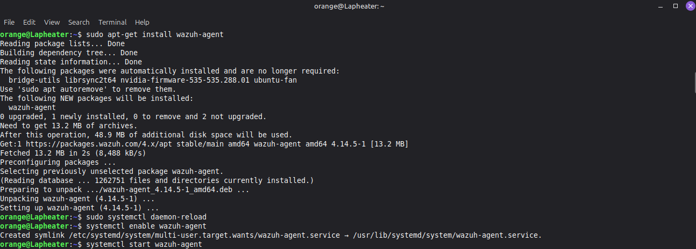
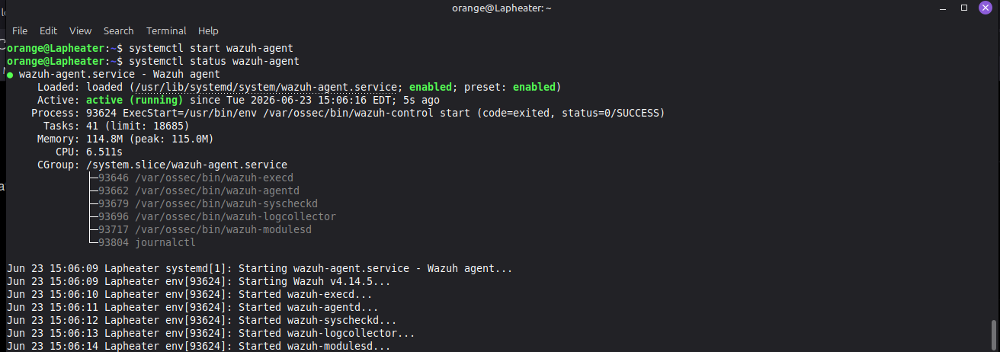
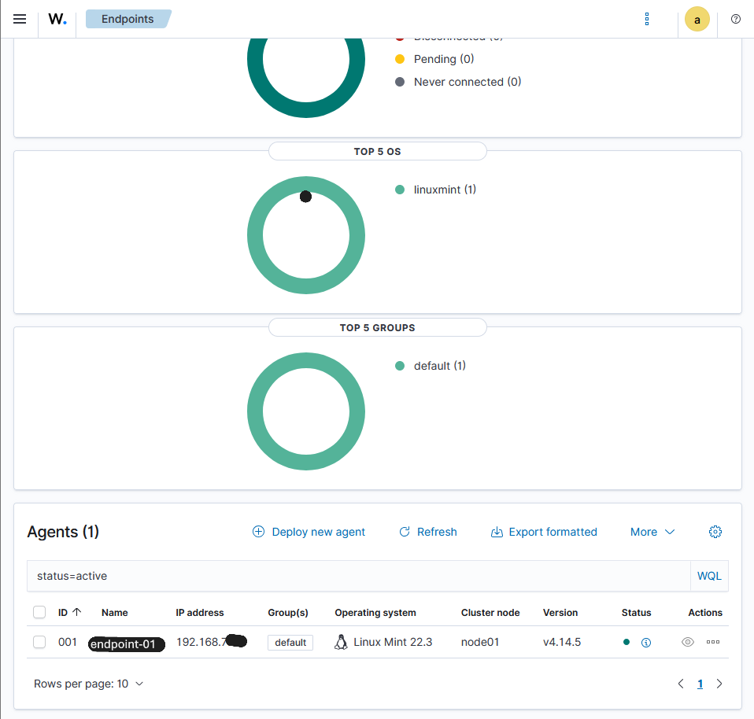
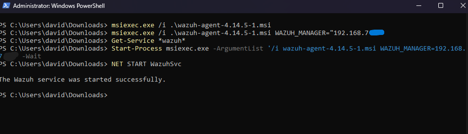
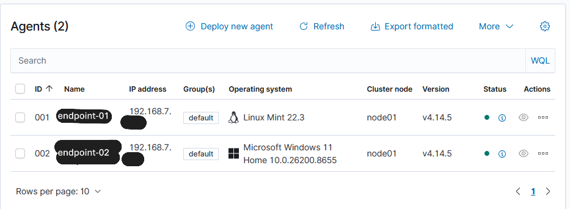

# Home Lab SIEM project
Welcome! This is my documentation of my learning process with Wazuh. I decided to start with Wazuh in order to learn more about endpoint security, log monitoring, and to get familiar with an enterprise level SIEM. 

# Overview

In this documentation, I have:
- Installed a Wazuh server on an Ubuntu virtual machine
- Installed a Wazuh agent on two separate devices (Linux Mint laptop and Windows 11 PC)
- Ensured that the agents were connected to the server

# Network Topology
I decided to run the Wazuh server on my desktop computer (endpoint-02), since it has more resources than my laptop (endpoint-01). In order to accomplish this, I had to use a virtual machine since Wazuh only supports a few select operating systems. I decided to go with Ubuntu. After I installed the server, I installed an agent on endpoint-01, and an agent on endpoint-02. So I have endpoint-02 running the VM with the server along with an agent, and endpoint-01 with an agent installed. Below is a diagram of the network:

<pre>
                              ┌─────────────┐
                              │  INTERNET   │
                              └──────┬──────┘
                                     │
                           ┌─────────┴─────────┐
                           │   HOME Network    │
                           │    192.168.7.x    │
                           └─────────┬─────────┘
                                     │
                                     │      
                                     │ Bridged LAN
                               192.168.7.xxxx
             
       ┌─────────────────────────────┼─────────────────────────────┐
       │                             │                             │
       ▼                             ▼                             ▼
┌───────────────┐           ┌─────────────────┐           ┌─────────────────┐
│ LINUX MINT    │           │   WINDOWS 11    │           │   UBUNTU VM     │
│ LAPTOP        │◄──────────│   HOST PC       │─────────▶│  (VirtualBox)   │
│               │           │                 │           │                 │
│ endpoint-01   │           │   endpoint-02   │           │  WAZUH STACK    │
│               │           │                 │           │                 │
│ • Wazuh Agent │◄──────────│• Wazuh Agent    │──────────▶│ • Manager       │
│               │           │ + Server Host   │           │ • Indexer       │
│               │           │                 │           │ • Dashboard     │
└───────────────┘           └─────────────────┘           └─────────────────┘
 
</pre>
                     

# Process

The first thing I did to start was to head over to [The Wazuh Docs](https://documentation.wazuh.com/current/getting-started/index.html) in order to figure out what to do. I decided to go the quickstart route, and followed the commands to install the Wazuh server on the Ubuntu VM. Below, you can see that I have installed and started the server.

Once that was running, I went to the webpage on localhost port 443 to login with the provided credentials and view the dashboard.

As you can see, at this point there were no agents running, and the data is all fluff. Time to change that by installing some agents. I started with endpoint-01.

Once that finished, I made sure it was running.

I checked the dashboard to verify that the agent could reach the server on the VM

Everything looked good, so I moved onto endpoint-02. I had some challenges with the Wazuh agent installation on Windows, but that was only because I misread a section and didn't download the .msi file required. Once I realized my mistake, I quickly corrected it by downloading the correct file and running the command provided by the docs. 

The service started successfully, so I went back to the dashboard to verify. 

Both endpoints have been connected and this concludes the lab... for now.
Stay tuned for part 2: Electric Bugaloo
