# Home Lab SIEM project
Welcome! This is my documentation of my learning process with Wazuh. I decided to start with Wazuh in order to learn more about endpoint security, log monitoring, and to get familiar with an enterprise-level SIEM. 

# Overview

In this documentation, I have:
- Installed a Wazuh server on an Ubuntu virtual machine
- Installed a Wazuh agent on two separate devices (Linux Mint laptop and Windows 11 PC)
- Ensured that the agents were connected to the server
- Configured additional log sources on Windows
- Added a custom directory for file integrity monitoring

# Network Topology
I decided to run the Wazuh server on my desktop computer (endpoint-02), since it has more resources than my laptop (endpoint-01). In order to accomplish this, I had to use a virtual machine since Wazuh only supports a few select operating systems. I decided to go with Ubuntu. After I installed the server, I installed an agent on endpoint-01, and an agent on endpoint-02. This means endpoint-02 serves two roles: it hosts the Ubuntu VM running the Wazuh server components, and it also runs a Wazuh agent directly on itself. Endpoint-01 runs a Wazuh agent directly on the Linux Mint host. Below is a diagram of the network:

<pre>
                              ┌─────────────┐
                              │  INTERNET   │
                              └──────┬──────┘
                                     │
                           ┌─────────┴─────────┐
                           │   HOME Network    │
                           │    192.168.7.x    │
                           └─────────┬─────────┘
                                     │
                                     │      
                                     │ Bridged LAN
                               192.168.7.xxxx
             
       ┌─────────────────────────────┼─────────────────────────────┐
       │                             │                             │
       ▼                             ▼                             ▼
┌───────────────┐           ┌─────────────────┐           ┌─────────────────┐
│ LINUX MINT    │           │   WINDOWS 11    │           │   UBUNTU VM     │
│ LAPTOP        │◄──────────│   HOST PC       │─────────▶│  (VirtualBox)   │
│               │           │                 │           │                 │
│ endpoint-01   │           │   endpoint-02   │           │  WAZUH STACK    │
│               │           │                 │           │                 │
│ • Wazuh Agent │◄──────────│• Wazuh Agent    │─────────▶│ • Manager       │
│               │           │ + Server Host   │           │ • Indexer       │
│               │           │                 │           │ • Dashboard     │
└───────────────┘           └─────────────────┘           └─────────────────┘
 
</pre>
                     

# Part 1

I started by reviewing [The Wazuh Docs](https://documentation.wazuh.com/current/getting-started/index.html) in order to figure out what to do. I decided to go the quickstart route, and followed the commands to install the Wazuh server on the Ubuntu VM. Below, you can see that I have installed and started the server.

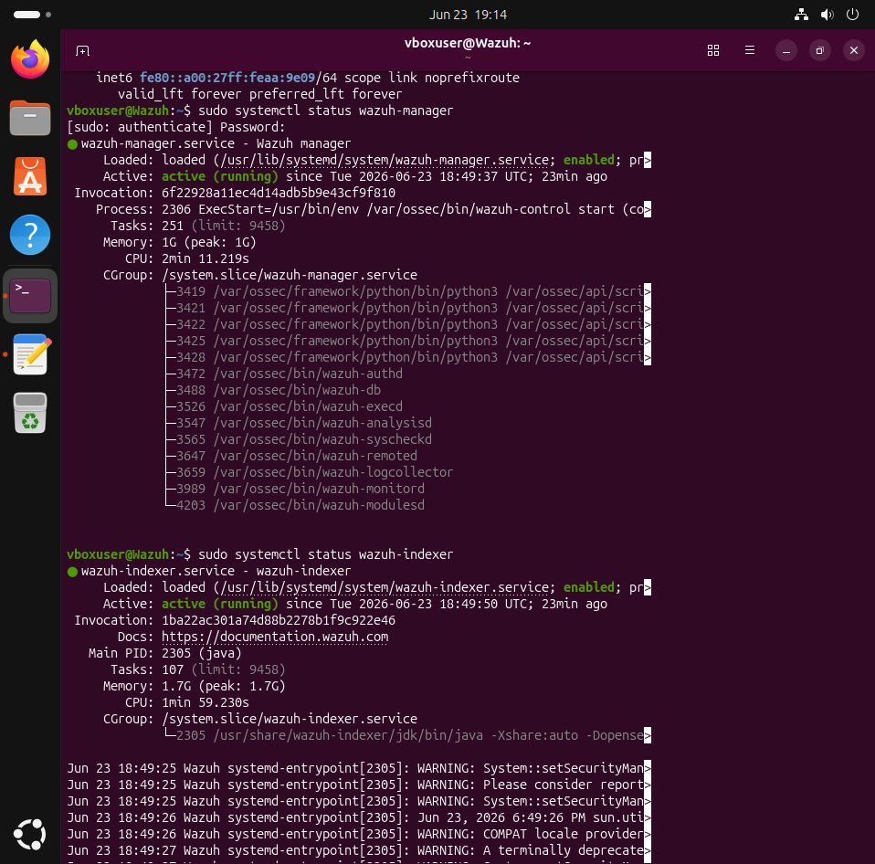

Once that was running, I went to the webpage on localhost port 443 to log in with the provided credentials and view the dashboard.

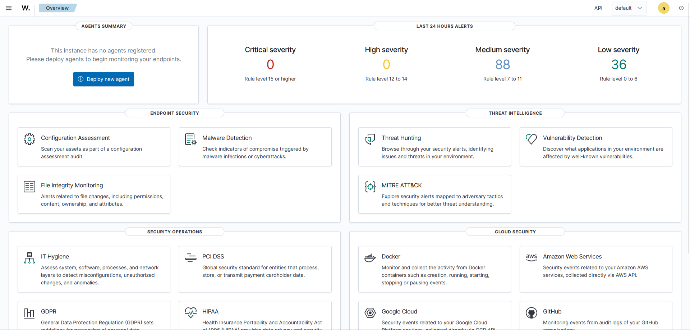

As you can see, at this point there were no agents running, and the data was all fluff. Time to change that by installing some agents. I started with endpoint-01.

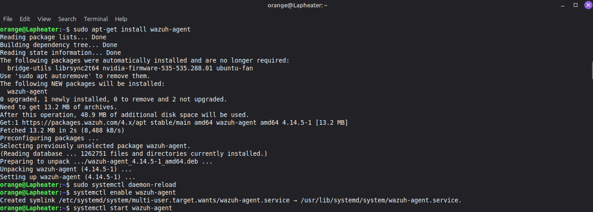

Once that finished, I made sure it was running.

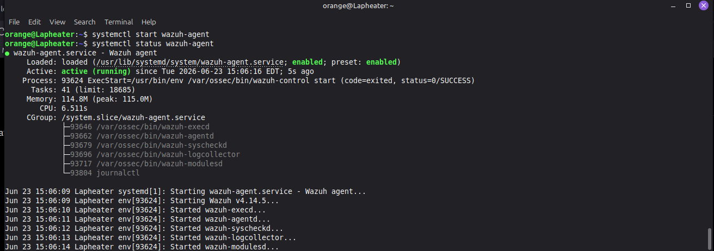

I checked the dashboard to verify that the agent could reach the server running on the VM.

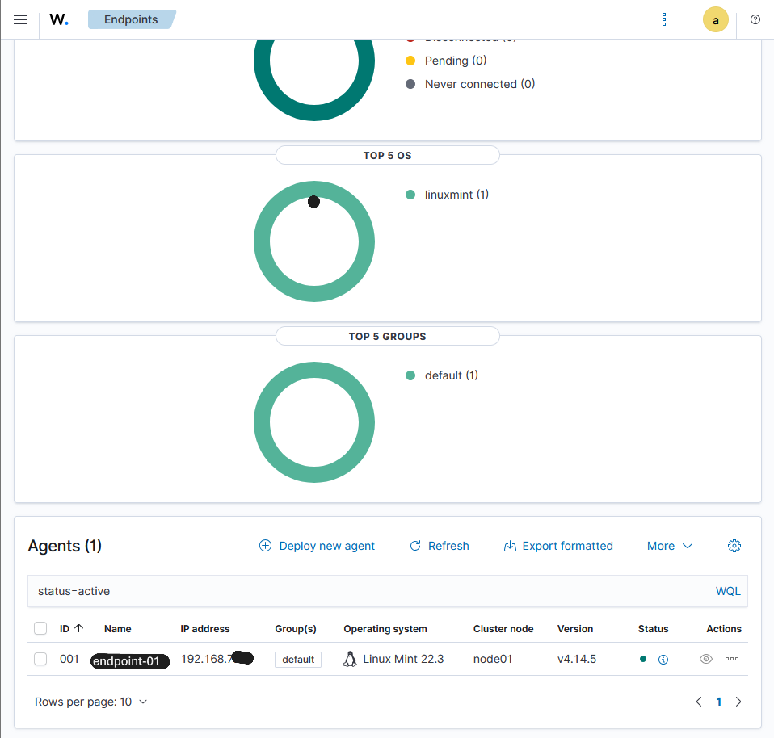

Everything looked good, so I moved on to endpoint-02. I had some challenges with the Wazuh agent installation on Windows, but that was only because I misread a section of the docs and didn't download the .msi file required. Once I realized my mistake, I quickly corrected it by downloading the correct file and running the command provided.

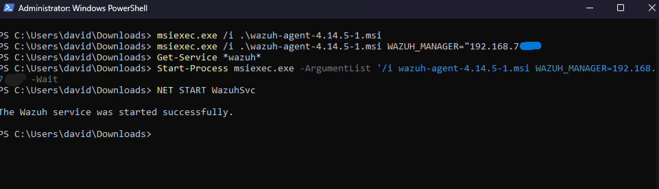

The service started successfully, so I went back to the dashboard to verify. 

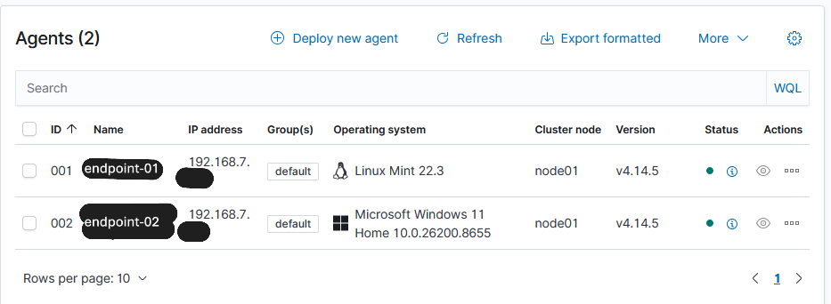

# Part 2: Adding Windows and Linux Logs

I wanted to add additional logging functionality, so I decided to add Windows and Linux logs for more alerts. 
I followed [this guide](https://github.com/UsmanPrime/Wazuh-Setup). 

Starting with Windows, I opened the `ossec.conf` file and added a section of code that would add Windows Defender events with appropriate alert levels to the Wazuh agent.
 
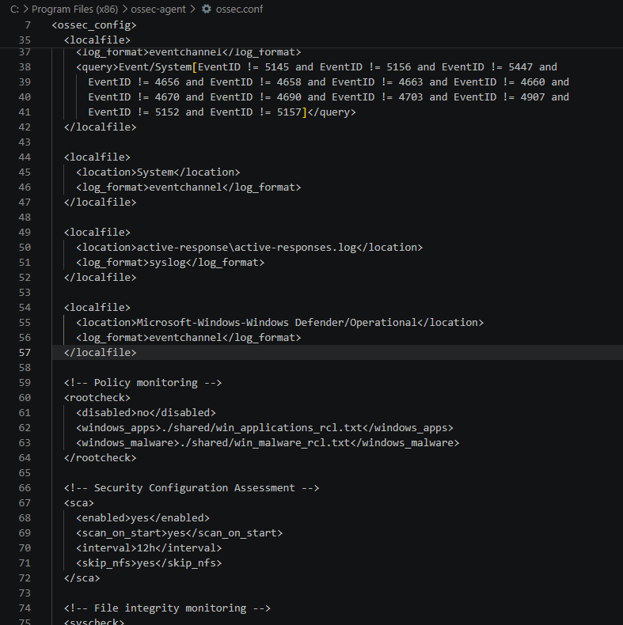

Then, for more detailed logging, I installed and configured Sysmon.

**Installation**

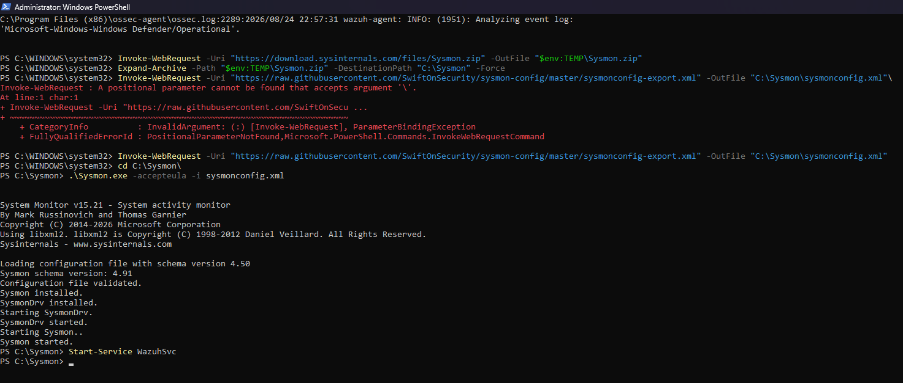

**Configuration**

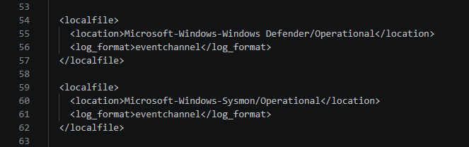

Lastly, I added monitoring of a custom directory, including notifications when a file was deleted, created, or modified. This is in addition to the directories already monitored by default.
Here I only created a test directory to show how it is done, but this process works for any folder on Windows. 

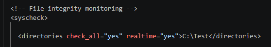

To test the alerts, I created, deleted, and edited some files. I used PowerShell to launch `notepad.exe` to generate sysmon events. I also downloaded the EICAR file to generate Windows Defender logs. 

Then, I went to the dashboard and verified that I could see that the alerts were triggered.

Windows Defender logs:
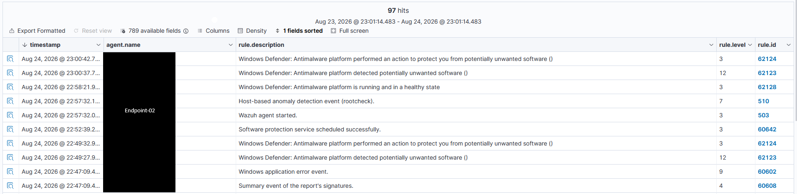

Sysmon log alerts and file monitoring alerts:
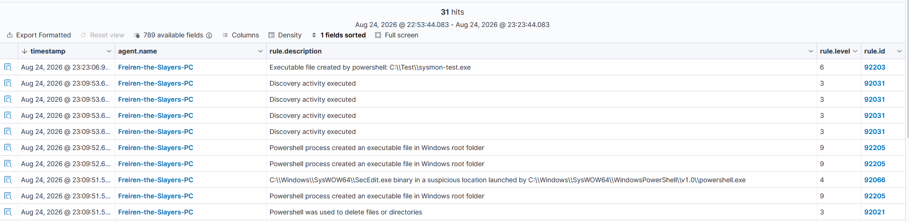

# Lessons Learned
This is what I have learned so far:

- How to install and configure Wazuh
- How to incorporate other Windows log sources into Wazuh agents
- Creating logs that would be picked up by different sources (Sysmon, Windows Defender)

What I want to learn next:
- How to add similar log sources on Linux
- How to analyze logs for malicious activity

Part 3 coming soon: Adding both systemd journal logs and directory monitoring on endpoint-01 on Linux.

